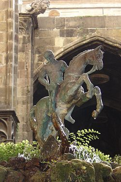
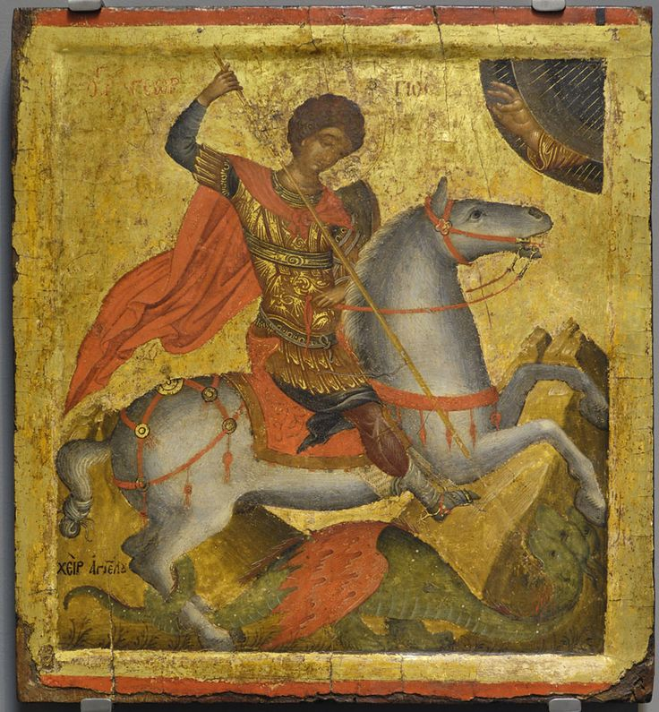
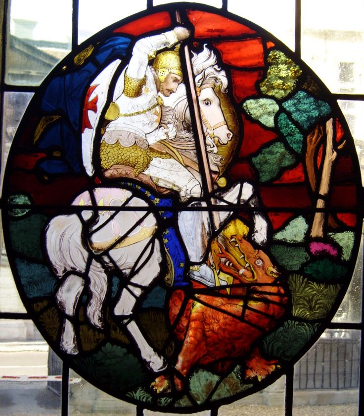

# St. George Detector

The present repository aims to provide an DL model to detect St. George on images.

## Results

Different parameters and optimizers were tested, as well as two pre-trained networks, VGG16 and ResNet5. Between the two, ResNet5 obtained the best results.


<center>

| Model    | learning rate | optim   | ACC    | F1     |
|----------|---------------|---------|--------|--------|
| ResNet50 |     0.0001    |   Adam  | 0.9815 | 0.9777 |
| ResNet50 |     0.0001    | RMSPorp | 0.9782 | 0.9733 |
|   VGG16  |     0.001     | Adagrad | 0.9056 | 0.9224 |

</center>


It was decided to use pre-trained models, because the styles of the photos varied: from stained glass, realistic and abstract paintings, statues, people, etc. 

<p align="center">
  
  
  
</p>

These networks in their first layers are already tuned for the detection of low-level features, while the upper ones are used for the extraction of more abstract features such as objects.

Thus, since most of the St. George pictures are composed of a man in armor, riding a horse, with sword or spear killing a lizard or dragon, it is expected that the pre-trained network will better capture those features and relate them appropriately.


## Reproductivity

To reproduce the obtained results, it is first necessary to create an environment and install the dependencies. The repository is cloned first.

```shell
git clone https://github.com/mjason98/detgeorges.git
cd detgeorges
```

Then create the environment and install the dependencies with pip.

```shell
python -m venv .venv
source .venv/bin/activate
pip install -r requirements.txt
```

Then, the CSV files are copied as training dataset, where <path_to_file> is the path to them:

```shell
cp <path_to_file>/georges.csv .
cp <path_to_file>/non_georges.csv .
```

For the test dataset, copy the ZIP file, unzip it and rename the folder to 'test':

```shell
unzip <path_to_file>/george_test_task.zip -d test
```

To train the model, with the parameters that gave the best result, execute the following command.

```shell
python main.py
```

At the end of its execution, it will show the metrics obtained in the test set. Pre-trained networks as well as training data are automatically downloaded.

### Detect St. George in a single image

To detect St. George in a single image, use the following command with the path to the image.

```shell
python main.py --notrain -p <image path>
```

The above command depends on having previously trained the model, if not, it is preferable to just use the '-p' parameter to train the model first and then perform future classifications.


```shell
python main.py -p <image path>
```